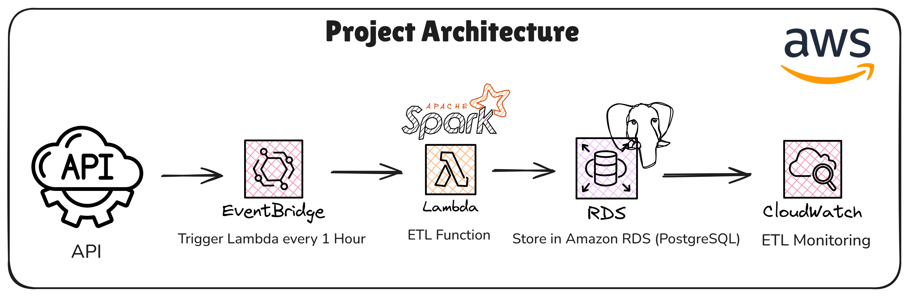
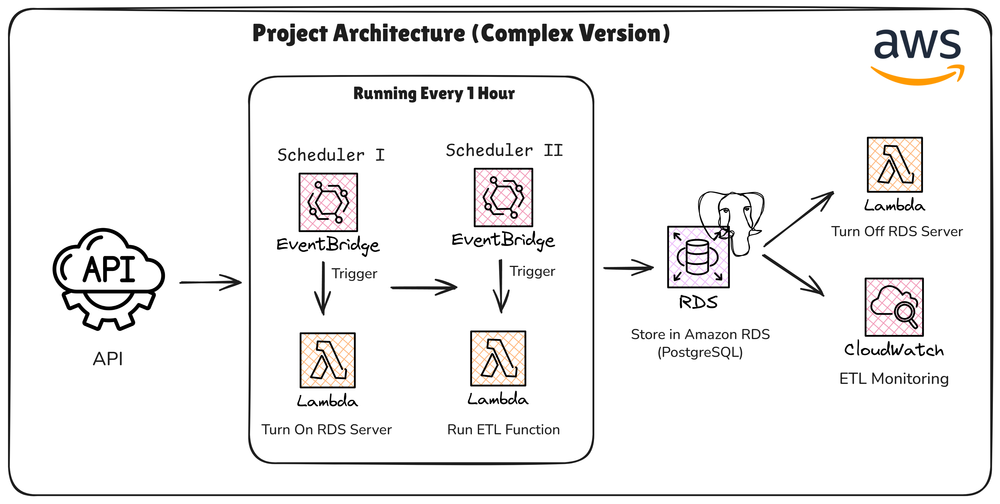

# AWS Serverless ETL Pipeline Architecture

Build an automated serverless ETL pipeline to collect API data hourly and store it in a structured Amazon RDS database with very low cost efficiency.

## 📌 Problem Statement
1. Periodic data retrieval from APIs requiring automation  
2. Need for a lightweight ETL pipeline without heavy infrastructure  
3. High operational costs due to always-on RDS  

## 🎯 This Architecture is Suitable for
- Small to medium-scale data ingestion (hourly batch)  
- Monitoring, analytics, or API-based reporting use cases  
- Companies that require low-cost architecture  
- Systems that do not require real-time streaming  

## 🏗️ Implementation
1. Build an ETL pipeline using AWS Lambda as the compute layer  
2. Scheduling using AWS EventBridge (cron-based trigger every 1 hour)  
3. Store data in Amazon RDS PostgreSQL  
4. Add an orchestration layer for RDS lifecycle management (automatic start/stop)  
5. Monitor the pipeline using AWS CloudWatch  

## 🔁 Workflow (Pipeline)
1. EventBridge Scheduler I → triggers Lambda to start RDS  
2. EventBridge Scheduler II → triggers Lambda to run ETL  
    - Fetch data from API  
    - Transform data (cleaning, transforming & mapping)  
    - Load into PostgreSQL (RDS)  
3. After completion → another Lambda stops RDS  
4. CloudWatch logs and monitors the ETL  

## ✨ Key Features
- Cron-based triggers without manual servers  
- RDS runs only when needed, significantly reducing idle cost  
- Separate schedulers for:
  - Start RDS  
  - Run ETL  
  - Stop RDS  
- Logging and error tracking via CloudWatch  
- Easier debugging & observability  

## 🛠️ Technology Used
- AWS Lambda  
- AWS EventBridge  
- Amazon RDS (Relational Database Service)  
- AWS CloudWatch  
- Python  
- psycopg2 & boto3  

## 🧪 Technical Highlights
1. Uses multiple EventBridge rules to control when ETL runs  
2. Avoids the need for complex orchestration tools (such as Airflow)  
3. Starts the RDS server 5 minutes before ETL runs to avoid cold starts and prevent race conditions when the database is not ready  
4. Combination of Lambda + EventBridge + on-demand RDS lifecycle  
5. Optimized trade-off between latency vs cost  

## ⚠️ Challenges & Solutions
### 1. RDS Startup Latency
- RDS takes time to become ready after starting  
- **Solution:** Scheduling delay / offset between schedulers to ensure readiness  

### 2. ETL Failure Handling
- Risk of data not being loaded if Lambda fails  
- **Solution:** Logging + retry strategy + monitoring via CloudWatch  

### 3. Resource Coordination
- Synchronization between multiple schedulers  
- **Solution:** Split responsibilities per scheduler (single responsibility per trigger)  

## 📈 Impact / Result
1. Cost Efficiency → Significantly reduces RDS costs by shutting down instances when idle  
2. Operational Simplicity → No need for persistent servers (fully serverless ETL)  
3. Scalability → Easily scalable by adjusting trigger frequency or Lambda configuration  
4. Reliability → Pipeline runs automatically without manual intervention  

## 🔮 Future Improvements
- Integration with Step Functions for more robust orchestration  
- Implementation of retry + dead-letter queue (DLQ) for error handling  
- Addition of a data validation layer before loading into the database  
- Migration to Aurora Serverless v2 for auto-scaling database  
- Implementation of incremental load / CDC for data transfer efficiency
